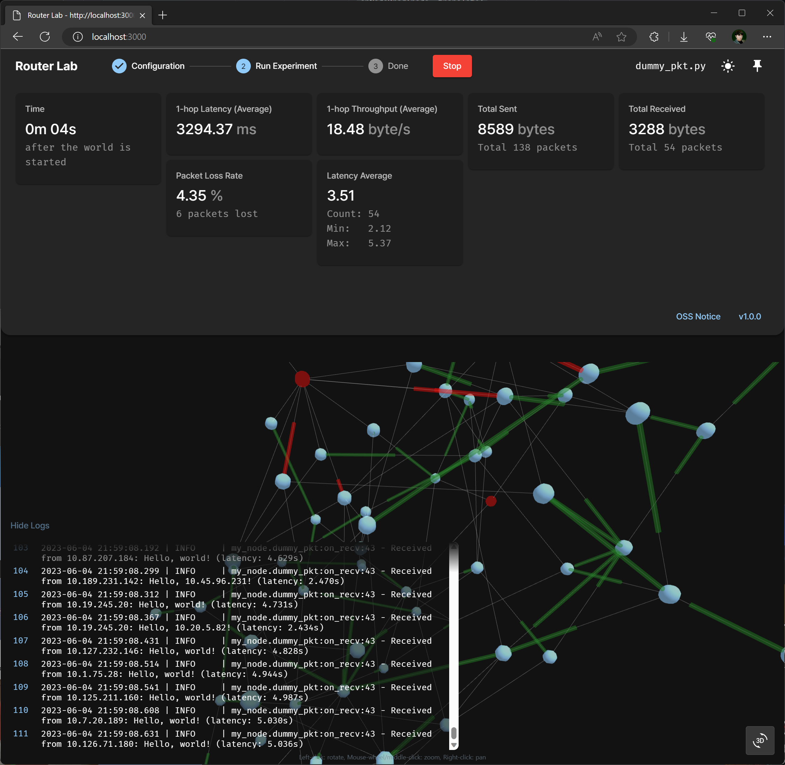

# Router Lab

<center></center>

<br/>

Implement your own routing algorithm on a simulated network.

This program has been created for educational purposes. Unlike real world networks, many parts have been omitted or replaced with simplified alternatives.

## Requirements

- Python 3.10 or higher

## Getting Started

1. Clone this repository.

   ```bash
   git clone https://github.com/wldhg/router-lab.git
   cd router-lab
   ```

2. Install dependencies.

   ```bash
   pip install .
   ```

3. Run the program.

   ```bash
   rlab run
   ```

4. Open the web browser and go to `http://localhost:7000`.
5. Follow the instructions on the web page. You may need to implement your own routing algorithm and packet structures in a file, and locate it on `my_nodes` directory.

---

&copy; wldhg. All Rights Reserved.\
&copy; 2023 POSTECH Artificial Intelligence of Things Laboratory, All Rights Reserved.
